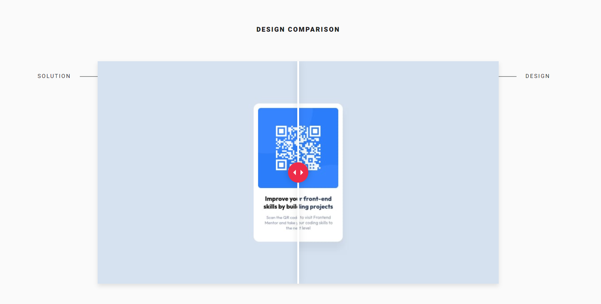

# Frontend Mentor - QR code component solution

This is a solution to the [QR code component challenge on Frontend Mentor](https://www.frontendmentor.io/challenges/qr-code-component-iux_sIO_H). 

## Table of contents

- [Overview](#overview)
- [Screenshot](#screenshot)
- [Links](#links)
- [Built with](#built-with)
- [Author](#author)

## Overview

### Screenshot

Comparison of solution and design:

### Links

- Solution URL: [GitHub repository](https://github.com/dominikapap/QR_code_challenge)
- Live Site URL: [QR Code on Netlify](https://qr-code-challenge-domipap.netlify.app/)

### Built with

- Semantic HTML5 markup
- CSS custom properties
- Flexbox

## Author

- Linkedin - [My LinkedIn profile](https://www.linkedin.com/in/dominika-papierska-1ba09311a/)
- Frontend Mentor - [@dominikapap](https://www.frontendmentor.io/profile/yourusername)
- Email - domi.papierska@gmail.com
